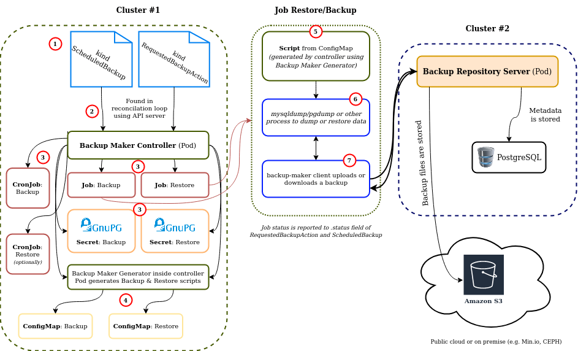

Backup Ecosystem Releases
=========================

Backup Repository is a complex system with a set of repositories, for this reason there is a release repository that releases a set of components compatible with each other.

We perform there End-To-End tests for selected software configurations.

Example flow
------------



1. Desired backup & restore definition is submitted by the user in form of `kind: ScheduledBackup`, `kind: RequestedBackupAction`
2. API server passes definitions to Backup Maker Controller
3. Backup Maker Controller creates `kind: Job`, `kind: CronJob`, `kind: Secret`
4. Backup & Restore procedures are templated by [Backup Maker Generator](https://github.com/riotkit-org/br-backup-maker/tree/main/generate) and put into `kind: ConfigMap`
5. When the `kind: Job` starts the generated script loaded from `kind: ConfigMap` is running inside a `kind: Pod`
6. **Some tooling (like mysqldump, psql, tar etc.) inside container** is used to dump or restore the data
7. [backup-maker CLI client](https://github.com/riotkit-org/br-backup-maker) is communicating with server to download or upload the backup

Versioning
----------

`main` branch always points to latest versions of Backup Repository components.
In order to make a release there is a release branch created, then tagged.

### Creating a new release

1. Create a new branch within a convention `release-x.y` (only up to major + minor)
2. Set desired component versions in `release.env` file
3. Push and wait for tests to pass on GitHub Actions
4. Push a tag with a target version `vx.y.z` (up to major + minor + patch)
5. Create release notes including all components

Testing
-------

```bash
make test
```

### Requirements

The following requirements are automatically installed when using `make` to run tests.

- Skaffold: v2.0.0+
- Docker
- K3d: ~v5.4.6 (k3s ~v1.24)
- Helm: v3
- Pipenv
- Python 3.9+
- kubectl v1.24+
- kubens


### Advanced

#### Using backup-repository and backup-maker-controller from local directories instead of cloning during the tests.

```bash
rm .build/backup-maker-operator -rf
rm .build/backup-repository -rf
ln -s {backup-operator-path-there} $(pwd)/.build/backup-maker-operator
ln -s {backup-repository-path-there} $(pwd)/.build/backup-repository
```

Then run tests with:
```bash
export SKIP_GIT_PULL=true
```

#### Skipping installation of server and client

```bash
export SKIP_CLIENT_SERVER_INSTALL=true
```

#### Increasing verbosity

```bash
export VERBOSE=true
```
