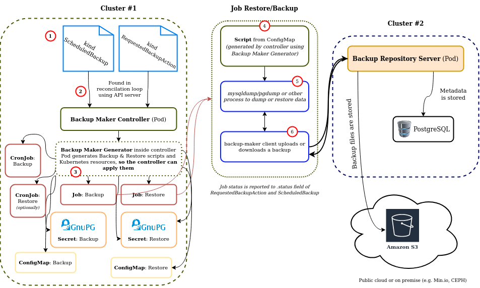

Backup Ecosystem Releases
=========================

Backup Repository is a complex system with a set of repositories, for this reason there is a release repository that releases a set of components compatible with each other.

We perform there End-To-End tests for selected software configurations.

Micro components roles
----------------------

Backup Maker Ecosystem consists of multiple elements, on following diagram you can see how those are cooperating with each other.
In most cases it is up to you to choose which components do you use.


Example flow (Kubernetes)
-------------------------



1. Desired backup & restore definition is submitted by the user in form of `kind: ScheduledBackup`, `kind: RequestedBackupAction`
2. API server passes definitions to Backup Maker Controller
3. Backup & Restore procedures are templated by [Backup Maker Generator](https://github.com/riotkit-org/br-backup-maker/tree/main/generate), then Backup Maker Controller is applying those Kubernetes resource to the cluster
4. When the `kind: Job` starts the generated script loaded from `kind: ConfigMap` is running inside a `kind: Pod`
5. **Some tooling (like mysqldump, psql, tar etc.) inside container** is used to dump or restore the data
6. [backup-maker CLI client](https://github.com/riotkit-org/br-backup-maker) is communicating with server to download or upload the backup

#### backup-maker-controller role

Orchestration. Backup & Restore definitions written in `kind: ScheduledBackup` and `kind: RequestedBackupAction` are changed into pure Kubernetes resources like `kind: Job`, `kind: Secret`, `kind: ConfigMap`.

#### backup-maker generator role

Backup Maker Generator is generating Backup & Restore scripts and templating Kubernetes resources.
When you run a `backup-maker generate backup` or `backup-maker generate restore` subcommand a script and Kubernetes resources as plain YAMLs are generated.
**The same thing is performed by Backup Maker Controller**, when it is receiving your `kind: ScheduledBackup` definition.

#### backup-maker client role

The client is used inside a script, that in Kubernetes is executed inside a Pod.

1. After Backup Maker Controller applies `kind: Job` or `kind: CronJob` the cluster is creating a `kind: Pod`.
2. The `kind: Pod` fetches a shell script with a backup & restore procedure **(generated previously by the generator)** and executes.
3. Executed script calls required client tools like pg_dump, mysqldump, tar etc. to prepare the data, **and calls backup-maker client to interact with the server - upload or download**


Versioning
----------

`main` branch always points to latest versions of Backup Repository components.
In order to make a release there is a release branch created, then tagged.

### Creating a new release

1. Create a new branch within a convention `release-x.y` (only up to major + minor)
2. Set desired component versions in `release.env` file
3. Push and wait for tests to pass on GitHub Actions
4. Push a tag with a target version `vx.y.z` (up to major + minor + patch)
5. Create release notes including all components

Testing
-------

```bash
make test
```

### Requirements

The following requirements are automatically installed when using `make` to run tests.

- Skaffold: v2.0.0+
- Docker
- K3d: ~v5.4.6 (k3s ~v1.24)
- Helm: v3
- Pipenv
- Python 3.9+
- kubectl v1.24+
- kubens


### Advanced

#### Using backup-repository and backup-maker-controller from local directories instead of cloning during the tests.

```bash
rm .build/backup-maker-controller -rf
rm .build/backup-repository -rf
ln -s {backup-operator-path-there} $(pwd)/.build/backup-maker-controller
ln -s {backup-repository-path-there} $(pwd)/.build/backup-repository
```

Then run tests with:
```bash
export SKIP_GIT_PULL=true
```

#### Skipping installation of server and client

```bash
export SKIP_SERVER_INSTALL=true
export SKIP_CLIENT_INSTALL=true
```

#### Increasing verbosity

```bash
export VERBOSE=true
```
